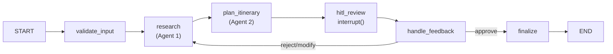

# AI Travel Planner — Architecture Overview

## Files Created

### Config Layer
| File | Purpose |
|------|---------|
| [settings.py](ai-travel-planner/src/ai_travel_planner/config/settings.py) | Centralized settings from env vars (`OPENAI_API_KEY`, `SERPER_API_KEY`, model config, limits) |
| [.env.example](ai-travel-planner/.env.example) | Template for required environment variables |

### Repository Layer
| File | Purpose |
|------|---------|
| [plan_repository.py](ai-travel-planner/src/ai_travel_planner/repository/plan_repository.py) | Thread-safe in-memory store (`PlanRecord` + `PlanRepository`) with asyncio locking for concurrent access |

### Services Layer
| File | Purpose |
|------|---------|
| [workflow.py](ai-travel-planner/src/ai_travel_planner/services/workflow.py) | **Orchestrator** — LangGraph `StateGraph` with `MemorySaver` checkpointer and `interrupt()` for HITL |
| [research_agent.py](ai-travel-planner/src/ai_travel_planner/services/research_agent.py) | **Agent 1** — Multi-turn ReAct loop producing structured destination research JSON |
| [itinerary_agent.py](ai-travel-planner/src/ai_travel_planner/services/itinerary_agent.py) | **Agent 2** — Builds day-by-day itinerary respecting budget/distance constraints |
| [plan_service.py](ai-travel-planner/src/ai_travel_planner/services/plan_service.py) | Bridges API ↔ Workflow — handles background task dispatch and response assembly |

### Tools (4 total)
| File | Agent | Purpose |
|------|-------|---------|
| [web_search.py](ai-travel-planner/src/ai_travel_planner/services/tools/web_search.py) | Research | Serper.dev API web search |
| [weather.py](ai-travel-planner/src/ai_travel_planner/services/tools/weather.py) | Research | Open-Meteo 16-day forecast (free, no key) |
| [distance_calculator.py](ai-travel-planner/src/ai_travel_planner/services/tools/distance_calculator.py) | Itinerary | Haversine distance + travel time estimates |
| [budget_allocator.py](ai-travel-planner/src/ai_travel_planner/services/tools/budget_allocator.py) | Itinerary | Destination-aware budget split across categories |

### Implementation Layer
| File | Purpose |
|------|---------|
| [default_api_impl.py](ai-travel-planner/src/ai_travel_planner/impl/default_api_impl.py) | Concrete subclass of `BaseDefaultApi` — auto-discovered by `pkgutil` |

---

## Workflow Graph



## HITL Mechanism

1. **`POST /plan`** → Creates plan, launches `graph.ainvoke()` as a background task
2. Graph runs `validate → research → plan_itinerary`, then **pauses** at `interrupt()` in `hitl_review`
3. **`GET /plan/{id}`** → Returns status `awaiting_review` + `draft_itinerary`
4. **`POST /plan/{id}/review`** → Resumes graph via `Command(resume=feedback)`
   - `approve` → finalizes immediately
   - `reject` / `modify` → loops back through research + planning
5. **`GET /plan/{id}/final`** → Returns the approved `final_itinerary`

## Setup

```bash
# 1. Copy and fill environment variables
cp .env.example .env

# 2. Create a virtual environment (Optional, but recommended)
uv venv venv

# 3. Activate the virtual environment
. venv/Scripts/activate

# 4. Install dependencies (if not already)
uv pip install -r requirements.txt

# 5. Run
cd src/
python -m ai_travel_planner.main
```

> [!IMPORTANT]
> You need valid `OPENAI_API_KEY` and `SERPER_API_KEY` in your `.env` file for the agents to work.
